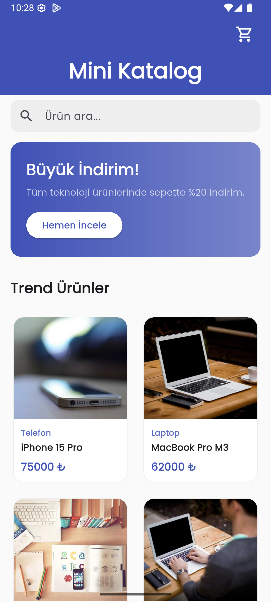
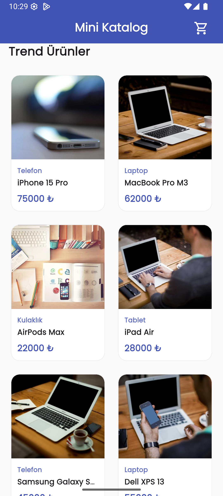

# 📱 Mini Katalog Uygulaması / Mini Catalog App

Language: [Türkçe](#-türkçe) | [English](#-english)

---

## 🇹🇷 Türkçe

Yazılım stajı kapsamında geliştirilen, ürünlerin JSON verisinden dinamik olarak yüklendiği, modern arayüzlü ve tam fonksiyonel bir Flutter mobil katalog uygulamasıdır.

### 📸 Ekran Görüntüleri

| Ana Sayfa | Ürün Detay | Sepet Sayfası |
| :---: | :---: | :---: |
|  |  |  |

---

### 🚀 Kullanılan Teknolojiler

Bu proje, modern mobil uygulama geliştirme standartlarına uygun olarak aşağıdaki teknolojilerle inşa edilmiştir:

*   **Flutter (Sürüm: 3.10.0 veya üzeri)**: Google'ın cross-platform mobil uygulama geliştirme framework'ü.
*   **Dart (Sürüm: 3.0.0 veya üzeri)**: Null-safety destekli, güçlü tip güvenliğine sahip programlama dili.
*   **Material Design 3**: Google'ın en güncel tasarım dili ile modern ve estetik bileşenler.
*   **Google Fonts (Sürüm: 6.1.0)**: Okunaklılık ve profesyonel görünüm için tercih edilen Poppins tipografisi.
*   **JSON Serialization**: Verilerin yerel bir `products.json` dosyasından asenkron olarak çekilip modellenmesi.
*   **State Management (setState)**: Uygulama içi dinamik güncellemeler için temiz ve performanslı durum yönetimi.

---

### ✨ Uygulama Özellikleri

#### 🏠 Ana Sayfa
*   **Ürün Listeleme**: Modern kart yapısında estetik görünüm.
*   **Arama Kutusu**: Ürün başlıklarına göre anlık filtreleme.
*   **Banner Alanı**: Kampanyaların sergilendiği gradyan geçişli görsel alan.
*   **GridView Görünümü**: Düzenli ve responsive ızgara yapısı.

#### 📦 Ürün Listeleme
*   **GridView.builder**: Yüksek performanslı ve verimli liste yönetimi.
*   **Dinamik Veri Yükleme**: JSON formatındaki verilerin modele aktarımı.
*   **Kart Tabanlı Tasarım**: Yuvarlatılmış köşeler ve gölgelendirme efektleri.

#### 🔍 Arama Özelliği
*   **Gerçek Zamanlı Filtreleme**: Kullanıcı yazdıkça anlık güncellenen liste.
*   **Ürün Adına Göre Arama**: Aranan ürüne hızlı ve kolay erişim.

#### 📄 Ürün Detay Sayfası
*   **Büyük Ürün Görseli**: Ürünü detaylı inceleme imkanı.
*   **Ürün Açıklaması**: Detaylı bilgi metni.
*   **Fiyat ve Kategori Bilgisi**: Ürüne ait spesifik bilgilerin estetik sunumu.
*   **Sepete Ekleme İşlemi**: Tek tıkla ürün ekleme ve SnackBar bildirimi.

#### 🛒 Sepet Sistemi
*   **Ürün Ekleme**: Seçilen ürünlerin sepete aktarılması.
*   **Ürün Silme**: Sepetteki ürünlerin kolayca kaldırılması.
*   **Toplam Fiyat Hesaplama**: Toplam tutarın anlık olarak hesaplanması.
*   **Satın Alma Simülasyonu**: "Satın Al" butonu ile başarılı işlem bildirimi.

---

### 🎓 Eğitim Kapsamında Kazanımlar

Bu proje sonunda aşağıdaki teknik ve pratik yetkinlikler elde edilmiştir:

*   Flutter mimarisini ve çalışma prensiplerini anlama.
*   Widget ağacı (Widget Tree) mantığını kavrama.
*   Stateless ve Stateful widget'ların verimli kullanımı.
*   JSON veri modelleme ve **factory** (fromJson/toJson) yapıları.
*   GridView ile responsive listeleme teknikleri.
*   Navigator kullanımı ve **Route Arguments** ile veri taşıma.
*   Temel state yönetimi ve yaşam döngüsü kontrolü.
*   Asset (görsel, json) yönetimi ve klasörleme mantığı.
*   Modern Mobil UI/UX tasarımı uygulama.

---

### 📁 Proje Klasör Yapısı

```text
lib/
├── main.dart                 # Uygulama ayarları, Tema ve Rotalar
├── models/
│    └── product.dart         # Ürün veri modeli
├── data/
│    └── product_data.dart    # JSON servisleri ve global sepet yönetimi
├── screens/
│    ├── home_screen.dart     # Liste ve Arama (Sliver mimarisi)
│    ├── product_detail_screen.dart # Detay bilgileri
│    └── cart_screen.dart     # Sepet ve Ödeme ekranı
├── widgets/
│    ├── product_card.dart    # Grid kart bileşeni
│    └── search_bar_widget.dart # Arama bileşeni
└── assets/
     └── products.json        # 30+ ürünlük veri seti
```

---

### 🛠️ Kurulum

#### 1. Bağımlılıkları Yükle
Terminalde proje ana dizinine gidin ve şu komutu çalıştırın:
```bash
flutter pub get
```

#### 2. Uygulamayı Çalıştır
```bash
flutter run
```
*Belirli bir cihaz/emülatör için:* `flutter run -d emulator-5554`

---

### 📂 GitHub Repository

Proje, GitHub üzerinde paylaşılmak üzere tam dökümantasyonla hazırlanmıştır.
**Repository İçeriği:** Kaynak kodlar, README.md, Ekran görüntüleri (img/) ve Asset dosyaları.

---

### 📋 Proje Çıktıları

✅ Çalışan Mini Katalog Uygulaması
✅ Ana Sayfa & GridView Tabanlı Tasarım
✅ Ürün Listeleme & Detay Sayfası
✅ Navigator & Route Arguments Kullanımı
✅ JSON Veri Modelleme & Asset Yönetimi
✅ Canlı Arama & Filtreleme
✅ Tam Fonksiyonel Sepet & State Yönetimi

---
---

## 🇺🇸 English

A professional Flutter mobile catalog application featuring dynamic data loading from JSON, Material 3 design, and a fully functional cart system.

### 🚀 Technologies Used
*   **Flutter (Version: 3.10.0 or higher)**: Google's cross-platform framework.
*   **Dart (Version: 3.0.0 or higher)**: Null-safe, type-safe programming language.
*   **Material Design 3**: Latest design language for modern UI components.
*   **Google Fonts (Version: 6.1.0)**: Professional Poppins typography.
*   **JSON Serialization**: Async data fetching and modeling from local storage.
*   **State Management (setState)**: Clean state handling for real-time updates.

### ✨ App Features
*   **Home Screen**: Instant search, dynamic banner, and responsive grid listing.
*   **Product Listing**: High-performance `GridView.builder` with clean card design.
*   **Product Details**: Large images, rating, descriptions, and interactive "Add to Cart" button.
*   **Cart System**: Item management, real-time total price calculation, and checkout simulation.

### 🎓 Educational Gains
*   Mastering Flutter architecture and Widget Tree logic.
*   JSON data modeling with `fromJson` / `toJson`.
*   Advanced Navigation with Route Arguments.
*   Project organization and Asset management.
*   Practical State Management using `setState`.

### 🛠️ Installation & Setup
1. `flutter pub get` - Install dependencies.
2. `flutter run` - Start the application.
